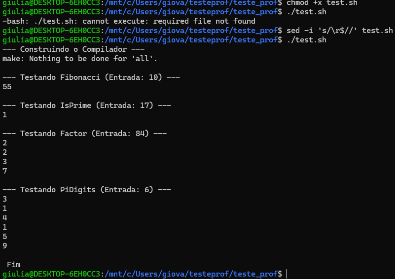
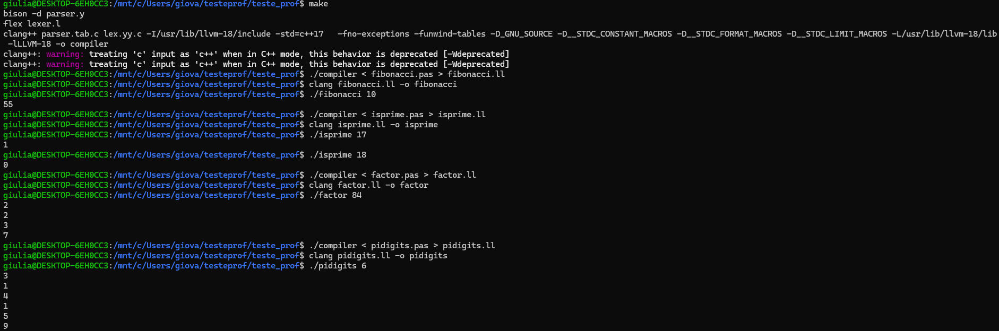

# Compilador de Subconjunto Pascal para LLVM IR 🚀

Este projeto consiste no desenvolvimento de um compilador para um subconjunto da linguagem Pascal, gerando código intermediário (LLVM IR) nativo e compatível com a infraestrutura moderna do **LLVM 18**. 

O projeto foi desenvolvido como parte dos requisitos práticos da disciplina de Compiladores.

## 👥 Integrantes do Grupo
* **Geovanna Cristina Brenzinger**
* **Grazielle Batista de Almeida**
* **Giulia Meninel Mattedi**

---

## 🛠️ Especificações Técnicas do Compilador

O compilador foi estruturado utilizando as ferramentas clássicas de engenharia de linguagens de programação:
* **Análise Léxica (`lexer.l`):** Desenvolvido em **Flex**, responsável por mapear palavras-reservadas (`program`, `begin`, `end`, `if`, `while`, `ParamStr`), identificadores, números e operadores lógicos/aritméticos.
* **Análise Sintática (`parser.y`):** Desenvolvido em **Bison (Yacc)**, definindo a gramática estruturada e tratando a precedência de operadores.
* **Árvore Sintática Abstrata (`ast.h`):** Código de suporte em C++ que contém a definição dos nós da Árvore Sintática Abstrata, a Tabela de Símbolos, a Análise Semântica (checagem de tipos) e a geração de código LLVM IR.
* **`Makefile`**: Arquivo de automação de build para compilar o projeto facilmente.
* **`test.sh`**: Script em Bash para compilar e rodar todos os programas de teste de uma vez.
* **`*.pas`**: Arquivos contendo os códigos-fonte dos 4 programas de teste obrigatórios (Fibonacci, Números Primos, Fatoração e Dígitos de Pi).

### Suporte ao LLVM 18 ⚙️
Para garantir compatibilidade com as versões estáveis e recentes do LLVM, o compilador adota:
1. **Ponteiros Opaque/Genéricos:** Migração de tipos obsoletos (`getInt8PtrTy`) para a especificação estável `llvm::PointerType::getUnqual(Context)`.
2. **Gerenciamento de Blocos de Controle:** Inserção explícita de desvios e rótulos condicionais utilizando a API pública `.insertInto(TheFunction)`.

---

## 📑 Funcionalidades Suportadas

O compilador aceita as seguintes construções da linguagem:
* Atribuições de variáveis (`:=`) e aritmética básica (`+`, `-`, `*`, `/`).
* Operadores relacionais (`<`, `>`, `=`, `<=`, `>=`, `<>`).
* Estrutura condicional pura (`if-then-else`) delimitada por blocos `begin ... end`.
* Laços de repetição (`while-do`).
* Leitura dinâmica de argumentos da linha de comando do Sistema Operacional através da função `ParamStr(Index)`.
* Saída padrão de dados por meio da função interna `writeln`.

---

## 🧪 Programas de Teste Obrigatórios

O repositório inclui os 4 casos de teste práticos exigidos no laboratório, adaptados para a gramática do compilador:

1. **`fibonacci.pas`**: Calcula o n-ésimo termo da sequência de Fibonacci de maneira iterativa.
2. **`isprime.pas`**: Algoritmo de verificação de número primo (retorna `1` para primo e `0` para composto).
3. **`factor.pas`**: Decompõe e imprime, linha por linha, os fatores primos do número fornecido.
4. **`pidigits.pas`**: Devolve os n primeiros digitos de pi. 

---

## 🚀 Como Compilar e Executar

Siga os passos manuais abaixo dentro do ambiente WSL/Linux para reconstruir o compilador e rodar os testes:

### 1. Configuração do Ambiente (Linux/WSL2)
Para instalar as dependências de desenvolvimento, execute no terminal:
```bash
sudo apt update
sudo apt install flex bison llvm-18 clang nasm make
```

### 2. Análise Léxica e Sintática

* **Scanner:** O Flex varre o arquivo-fonte em busca de palavras reservadas, ignorando comentários.
* **Parser:** O Bison utiliza um autômato finito determinístico com pilha para verificar a sintaxe. Quando uma regra gramatical é resolvida, ele dispara código C++ para criar um nó correspondente na AST.

### 3. Geração de Código LLVM IR

Para a geração de código, utilizamos a **LLVM C++ API**. Percorremos a AST gerada pelo Bison e utilizamos o `IRBuilder` do LLVM.

* O projeto está adaptado para as versões mais recentes do LLVM, utilizando **Ponteiros Opaque** (`llvm::PointerType::getUnqual(Context)`).
* O binário final é gerado de forma independente, ou seja, o executável gerado não depende de bibliotecas dinâmicas do compilador para rodar.

---

## 🚀 Como Construir o Compilador (Linking and Generating)

Utilize o `Makefile` disponibilizado na raiz do projeto para gerar o executável do compilador. No terminal, execute:

```bash
make
```

*Isso irá gerar os resultados do analisador léxico (`lex.yy.c`) e gramatical (`parser.tab.c`/`parser.tab.h`), compilar o C++ e linkar o LLVM, criando o executável `./compiler`.*

---

## 🚀 Como Compilar e Executar os Testes

O repositório inclui os 4 programas exigidos. Você pode testá-los através do nosso script automatizado ou executar cada um manualmente.

### Via Script Automático (Recomendado)

Para rodar todos os testes em sequência e verificar os resultados, execute:

```bash
chmod +x test.sh
sed -i 's/\r$//' test.sh
./test.sh
```

### Manualmente (Passo a passo para cada programa)

Conforme exigido, aqui estão os comandos para compilar e rodar cada um dos programas de teste individualmente:

**1. Fibonacci (`fibonacci.pas`):**
```bash
./compiler < fibonacci.pas > fibonacci.ll
clang fibonacci.ll -o fibonacci
./fibonacci 10
```

**2. Verificador de Número Primo (`isprime.pas`):**
```bash
./compiler < isprime.pas > isprime.ll
clang isprime.ll -o isprime
./isprime 17
```

**3. Fatoração (`factor.pas`):**
```bash
./compiler < factor.pas > factor.ll
clang factor.ll -o factor
./factor 84
```

**4. Dígitos de Pi (`pidigits.pas`):**
```bash
./compiler < pidigits.pas > pidigits.ll
clang pidigits.ll -o pidigits
./pidigits 6
```

### 📸 Evidência de Execução

Abaixo está a comprovação de que o compilador processou os códigos Mini-Pascal com sucesso e gerou os binários com as respostas corretas:

**Com test.sh:**


**Manualmente:**


---

## 🐛 Dicas de Depuração (Debugging) e Problemas Comuns

Se for modificar a linguagem ou o código, fique atento a:

1. **Conflitos Shift/Reduce:** O Bison pode reclamar de ambiguidades, especialmente em construções `if-then-else`. Utilizamos regras de `%nonassoc` no `parser.y` para resolver o problema do *dangling-else*.
2. **Segfault no LLVM:** O LLVM exigirá que toda variável seja declarada antes do uso. Verifique sempre se a variável já existe na sua `std::map` (Tabela de Símbolos) antes de invocar o `IRBuilder` para carregá-la.
3. **LLVM Types:** O LLVM não permite somar tipos diferentes diretamente (ex: i1 com i32). Garanta que os tipos sejam convertidos na etapa de análise semântica antes de gerar as instruções.

---

## 🤖 Declaração de Uso de IA (LLMs)

Ferramentas de Inteligência Artificial foram utilizadas como suporte técnico complementar:

* **Modelos:** ChatGPT / Gemini.
* **Codificação:** Auxílio pontual para entender a migração de tipos estritos para Ponteiros "Opaque" na API em C++ do LLVM 18.
* **Estruturação:** Auxílio na revisão de comandos do Git, criação do `Makefile`, `.gitignore` e formatação deste Markdown.
* **Exemplos de Prompts utilizados (Inglês):**
  * *"How to update getInt8PtrTy to opaque pointers in LLVM 18 C++ API?"*
  * *"Create a clean Makefile for a Flex, Bison, and LLVM 18 project."*